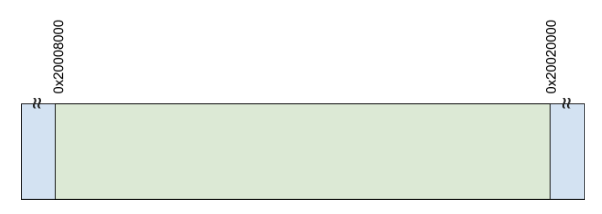
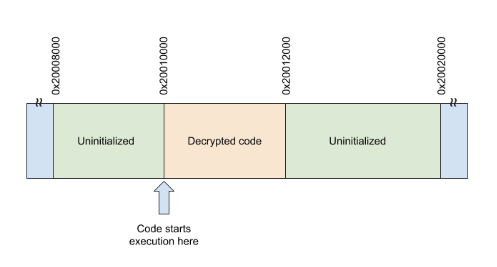
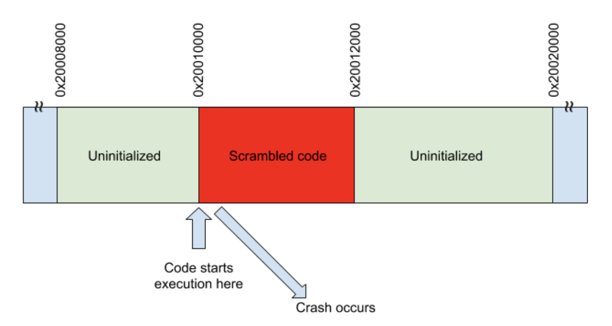
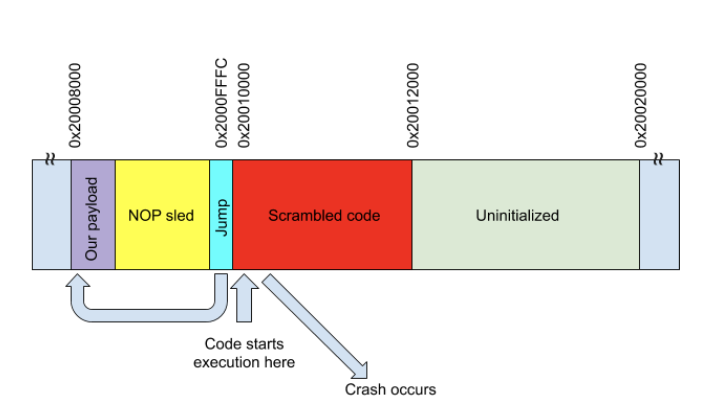
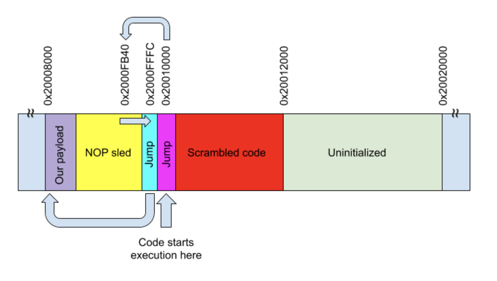

# Level 0

## Description of challenge (should be given to the player)
Once you have connected to the hackme board's serial port interface, pressing enter should give a prompt like this:
```
>_
```
At this point, you can type `status` to see all of the levels and how far you are on each, and `help` to see all possible commands. In order to try the first level, type `start 0` to begin.

The premise of this level is that there is a device that requires a 4-digit numeric PIN (digits 0-9 only, no letters) to unlock. The goal of the attacker is to recover this PIN.

## Hints for the user (to be revealed one-by-one)
1. "Just try guessing!"

## Context/Background/Motivation
This level is inspired by "Hollywood hacking" that depicts a hacker brute-forcing a secret combination one digit at a time.

## Vulnerability / Explanation
The device will immediately report that a certain digit is invalid as soon as it is entered (the user does not have to press Enter). Because of this, digits can be guessed independently of each other.

This means that an attacker has to guess a maximum of 10 guesses before knowing that they have the right number for that digit of the PIN. 10 guesses per digit, in a 4-digit PIN, means an attacker will always get the correct pin within 40 tries (10 guesses per digit * 4 digits). That can be done manually.

## Reference solution
The reference solution is to manually guess each digit one after another:
1. Input a 0. Note if an error was immediately returned or not.
2. If an error was returned, repeat step 1 with digits 1..9 inclusive.
3. If no error is returned, remember this value as the value of the first digit.
4. Repeat the entire process starting from 1, but prefix all guesses with the remembered digits.


## Learning objectives
This is intended as a warm-up exercise. It is simple enough that it does not require any automation. This level is intended to make sure that the user can properly connect to and communicate with the hackme board.


# Level 1

## Description of challenge (should be given to the player)
The challenge scenario is the same as in level 0, there is a 4-digit PIN that you have to guess. Try it! The feedback isn't quite the same.

## Hints for the user (to be revealed one-by-one)
1. It's possible to manually try every PIN combination..., but that would take a while. Is there a better way?
2. What if the computer guesses for you? Really quickly?
3. Consider reading the documentation for [pySerial](https://pythonhosted.org/pyserial/) or the equivalent for your favorite programming language

## Context/Background/Motivation
Four-digit PINs are still in common use in many applications. Although most of them probably have rate limiting, some of them might not. This level demonstrates why having rate limiting is critical.

## Vulnerability
This level is similar to level 0, but the device does require all 4 digits to be entered before reporting correct/incorrect. While too large for manual entry, 10^4 is still an inadequately small search space for a computer.

## Explanation / Reference solution
The solution to this problem is to "just" brute-force all 10^4 combinations. The reference code for this level can do so in much less than 5 minutes.

The reference solution needs to be run after the level is started. To do this, enter `start 1` in the console. Then quit the terminal emulator without unplugging the board. At this point, the board will still be expecting PIN numbers. The reference solution can then be run in order to try every PIN.

## Learning objectives
This level forces the attacker to set up automation to run brute-force attacks. It also demonstrates that brute-force can indeed be a viable approach.

For system designers, this level shows the complete inadequacy of 4-digit numeric PINs if there is no rate-limiting enforced.


# Level 2

## Description of challenge (should be given to the player)
The challenge scenario is the same as in level 0. However, this level has brute-force countermeasures. Specifically, there is a delay after every incorrect guess, and the device will trigger a "game over" after three incorrect guesses.

## Hints for the user (to be revealed one-by-one)
1. Why can't you use the same technique as before? What is stopping you?
2. Is there a way to make the retry limit not get decremented? Or to reset it?
3. Maybe there's an opportunity of some kind during that delay after incorrect guesses...
4. What other interfaces does the hackme have other than this console serial port? Can you use them?
5. What commands does the GDB debugger interface give you? You can see a list by connecting GDB (see [Black Magic Probe documentation](https://github.com/blacksphere/blackmagic/wiki/Getting-Started)) and then typing `mon help` in the GDB console.
6. Do you think that the `hard_srst` command might be useful?

## Context/Background/Motivation
This level demonstrates bypassing rate limits by using a "hardware" trick to bypass software-enforced rate limits. This level was inspired by US law enforcement conflicts with Apple regarding iPhone passcode rate and retry limits after the 2015 San Bernardino shooting.

## Vulnerability
The rate-limit is enforced only by software. In other words, the pseudo-code for this PIN validation code is:
```
if pin is correct {
    print("SUCCESS!")
} else {
    sleep(5)
    decrement retry counter
    print("Incorrect PIN")
}
```
There is no special "secure enclave" or environment that can make sure that the delay isn't bypassed. Also, the device does not store the decremented retry counter in nonvolatile memory until after the rate-limiting delay.

The two flaws mentioned above allow for an exploit relying on a "hardware" trick. It is possible to reset the microcontroller while it is sleeping to enforce the rate-limit. Because of the second flaw, this will conveniently also reset the microcontroller before the maximum number of retries is updated (so it will not actually be updated). Finally, an incorrect guess can also be distinguished from a correct guess because a correct guess will return a reply immediately without a delay.

## Explanation / Reference solution
An algorithm for breaking this challenge is:
1. Guess a PIN
2. Wait a small amount of time (1 ms in the reference code)
3. If a reply has already been received, the guess was correct. Exit
4. If no reply is received, the guess was incorrect, and the microcontroller is delaying now. Use the debugger interface to assert the reset pin by issuing the `hard_srst`  command (This command is documented in the documentation for the Black Magic Probe firmware. It is issued over the debugger's gdb serial port interface as a `monitor` command using the `qRcmd` packet type.). This causes the microcontroller to reset and return to the main menu without having to wait out the delay and without having updated the retry counter.
5. Select the next pin and repeat

## Learning objectives
This level tries to teach attackers to consider all "hardware" interfaces to a device (in this case, the reset pin) rather than just the "normal" interface (the console). In many real products, various interfaces (unused in the final product) are accidentally left open. For example, many Linux-based devices leave root consoles accessible on serial port test points. Many other devices also leave JTAG open.

This level is also a simple introduction to timing attacks. If different operations do not take a constant amount of time, this may be exploitable.

This level tries to teach system designers to try and lock down unnecessary hardware interfaces whenever possible (although in this specific case this advice cannot be applied as reset cannot be disabled).

It also teaches that security-sensitive code may need to defend against timing attacks. Although this is common in cryptography libraries, many systems (e.g. electronic locks) still do not do this correctly.

It also teaches that, for hardware devices that attackers can have physical access to, attackers can manipulate the system such that behaviors that were intended to occur do not actually occur correctly. In this level, the attacker can bypass the updating of the retry counter by performing a reset. In other cases, attackers can disconnect various components, disable "write" control signals, and other similar attacks. Code will need to take this into account. In this specific example, the code could have decremented the counter before checking the PIN, and the code can even go and verify that the updated counter was actually successfully updated before proceeding.


# Level 3

## Description of challenge (should be given to the player)
This level simulates a game of chance. The game offers the user a starting pool of money ($100). At every turn, the user can bet some amount of money and try to guess the value of a 6-sided dice. Correct guesses return twice the amount bet and incorrect guesses return nothing. The goal is to reach a certain total amount of money ($100,000).

## Hints for the user (to be revealed one-by-one)
1. What happens if you try to guess an invalid number? What about betting an invalid amount?
2. How do computers usually store integers? Are there some "special" values that the software might have forgotten to check for?

## Context/Background/Motivation
This level simulates inadequate input validation and integer overflows that are somewhat common in embedded systems.

This challenge was directly inspired by a CTF challenge that accidentally had this exact same bug in the exact same dice game. However, after speaking with the CTF organizers at the end of the event, it turns out that this was actually an unintended bug that they had overlooked.

## Vulnerability
There are some deliberate signed/unsigned confusions in the code. It is not possible to bet a negative number (the parser will reject it), but it is possible bet more than 2^31 dollars. This will then overflow the current amount of money to be a very large number. As long as this number is larger than 100000 when treated as an unsigned integer, the level will be deemed completed.

## Reference solution
Bet $4,000,000,000 (entered without a dollar sign or commas) with any arbitrary guess for the dice.

## Learning objectives
This level tries to teach attackers to test all input validation carefully. There are still many devices with this kind of trivial bug.

For system designers, this level tries to demonstrate the importance of very carefully checking that input validation is correct. In some cases, the programming language and/or environment can help with this. In this specific hackme, the code is written in Rust, and the bug is obvious in the source code (explicit cast to a signed number).


# Level 4

## Description of challenge (should be given to the player)
This level uses the same game of chance as the previous level.

## Hints for the user (to be revealed one-by-one)
1. Try playing the game multiple times. Do you notice anything suspicious about the first few rolls?
2. Try recording and comparing logs of multiple plays.

## Context/Background/Motivation
This level is intended to point out a common problem in "deeply embedded" devices in that do not have good sources of entropy (the chip being used actually does have a hardware RNG, but this level was deliberately made vulnerable by not using it).

This was the intended solution to the CTF challenge mentioned in Level 3.

This level was also vaguely inspired by various random number vulnerabilities in other systems that are described in more detail in a section below.

## Vulnerability
This level will return the exact same sequence of dice rolls every time it is restarted. The PRNG always starts with a fixed seed.

## Reference solution
The solution is to play the game once, bet minimal amounts, and write down the actual sequence of dice rolls. After enough dice rolls have been collected, exit and reenter the game. The second time around, the maximum amount of money can be bet each turn along with the dice rolls recorded from the previous play.

For example, suppose we interact with this level for 10 turns and bet $1 each turn and guess a dice roll of 1 each time. Suppose this gives us the following output:
```
> start 4
Entering Level 4 - "Play by the rules"

The same dice game, but bugfixed
You currently have $100. You need $1000 to proceed.
Place a bet and roll the dice. If you guess correctly, you get double back.
Bet? 1
Guess for dice roll (1-6)? 1
You guessed incorrectly :(
The dice roll was a 3
You currently have $99. You need $1000 to proceed.
Place a bet and roll the dice. If you guess correctly, you get double back.
Bet? 1
Guess for dice roll (1-6)? 1
You guessed correctly!
You currently have $100. You need $1000 to proceed.
Place a bet and roll the dice. If you guess correctly, you get double back.
Bet? 1
Guess for dice roll (1-6)? 1
You guessed incorrectly :(
The dice roll was a 4
You currently have $99. You need $1000 to proceed.
Place a bet and roll the dice. If you guess correctly, you get double back.
Bet? 1
Guess for dice roll (1-6)? 1
You guessed incorrectly :(
The dice roll was a 2
You currently have $98. You need $1000 to proceed.
Place a bet and roll the dice. If you guess correctly, you get double back.
Bet? 1
Guess for dice roll (1-6)? 1
You guessed correctly!
You currently have $99. You need $1000 to proceed.
Place a bet and roll the dice. If you guess correctly, you get double back.
Bet? 1
Guess for dice roll (1-6)? 1
You guessed incorrectly :(
The dice roll was a 4
You currently have $98. You need $1000 to proceed.
Place a bet and roll the dice. If you guess correctly, you get double back.
Bet?
```

In this example, we observe the following sequence of dice rolls: 3, 1, 4, 2, 1, 4. If we were to exit the game and replay it, we would get the exact same numbers every time. Therefore, to beat the game, we just need to guess 3, 1, 4, 2 and bet $100, $200, $400, $800, and so on:
```
> start 4
Entering Level 4 - "Play by the rules"

The same dice game, but bugfixed
You currently have $100. You need $1000 to proceed.
Place a bet and roll the dice. If you guess correctly, you get double back.
Bet? 100
Guess for dice roll (1-6)? 3
You guessed correctly!
You currently have $200. You need $1000 to proceed.
Place a bet and roll the dice. If you guess correctly, you get double back.
Bet? 200
Guess for dice roll (1-6)? 1
You guessed correctly!
You currently have $400. You need $1000 to proceed.
Place a bet and roll the dice. If you guess correctly, you get double back.
Bet? 400
Guess for dice roll (1-6)? 4
You guessed correctly!
You currently have $800. You need $1000 to proceed.
Place a bet and roll the dice. If you guess correctly, you get double back.
Bet? 800
Guess for dice roll (1-6)? 2
You guessed correctly!
<snip>
```

## Learning objectives
For attackers, this level demonstrates that PRNGs used in "embedded" devices (e.g. IoT devices using only a microcontroller) may have weaknesses that can be exploited. In this case the weakness can be seen by just careful observations.

For system designers, this level demonstrates the importance of properly seeding PRNGs. The STM32F4 chip family used to build this hackme has a hardware true-random-number-generator that can be used for seeding PRNGs (this is in fact used for the other levels involving this dice game). In other cases, it may be possible to extract entropy from various nondeterministic hardware sources such as clock jitter.

Note that it is not at all sufficient to use the voltage on a floating analog pin to seed a PRNG. This practice is [recommended by Arduino documentation](https://www.arduino.cc/reference/en/language/functions/random-numbers/randomseed/), but a quick test such as in [this article](https://hackaday.com/2018/01/08/entropy-and-the-arduino/) shows that this tends to generate a very small range of values.


# Level 5

## Description of challenge (should be given to the player)
This game is the same. This level uses an [LCG](https://en.wikipedia.org/wiki/Linear_congruential_generator) with the glibc constants:

`x_next = (1103515245*x + 12345) mod 2^31`

Each value is then first reduced to 8 bits by XOR-ing the four bytes of the result together. If the value is less than 252, it is then reduced modulo 6 to get the next dice roll. Otherwise, the value is discarded and another value is picked until it is less than 252. This is so that lower dice rolls are not biased to be more likely than higher ones (because 256 is not a multiple of 6).

## Hints for the user (to be revealed one-by-one)
1. Are there known issues with LCG PRNGs?
2. Is the above recurrence relation invertible?
3. Even if you do not have the full output of the PRNG, can you still recover useful data?
4. Consider the speed of modern computers. Do you necessarily need an "advanced" algorithm for this?

## Context/Background/Motivation
This level is intended to demonstrate why some PRNGs are considered "insecure" for certain applications.

This level was inspired by [this story](https://www.wired.com/2017/02/russians-engineer-brilliant-slot-machine-cheat-casinos-no-fix/) of Russians who cheated at slot machines by exploiting PRNG vulnerabilities, and by allegations that the NSA weakened cryptosystems by compromising their random number generators (i.e. Dual_EC_DRBG).

## Vulnerability
The flaw here is that each turn of the game will return the actual dice roll. This leaks some bits of the PRNG state. It is possible to write a tool to recover the actual state given enough turns.

## Reference solution
The reference solution is a naive brute-force implementation. However, it uses Rust and [Rayon](https://github.com/rayon-rs/rayon) in order to run on multiple cores. In experimental testing this required about 10 turns to recover the correct seed (each turn leaking ~3 bits). Once the PRNG's seed is recovered, it is then possible to predict all future outputs of the PRNG. The reference tool runs the same algorithm as the hackme to generate further dice rolls that match up perfectly with what the hackme generates. It may possible to improve upon this solution with more advanced techniques such as using SAT/SMT solvers.

## Learning objectives
For attackers, this level demonstrates that LCG PRNGs are exploitable. It is possible to predict all future outputs given just a small sequence of outputs. This level allows attackers to actually mount such an attack against a "more realistic" system where the full bits PRNG output are not available.

For system designers, this level demonstrates that a CSPRNG must be used if it is necessary to make sure that subsequent PRNG outputs cannot be predicted from previous values. In this hackme, other levels use the ChaCha20 stream cipher as a CSPRNG.


# Notes on RNG issues
Problems with random number generators have had some amount of attention recently due to a number of widely-publicized issues. This is a brief overview of some major ones.

* Montreal Casino Keno game (1994) - http://www.blackjackforumonline.com/content/how_to_beat_keno.htm - a casino had an electronic Keno game that always reset with the same seed every day. This made it possible for a player to guess 19 out of 20 numbers in a game correctly.

* Debian OpenSSL MD_Update patch (2008) - CVE-2008-0166 - Debian attempted to silence a Valgrind warning in OpenSSL and accidentally completely breaks the random number generator. This leads to the random number generator only being able to generate on the order of 2^15 different sequences which led to easily-factorable RSA keys and leaked private keys for people using DSA.

* Sony ECDSA private key "fail0verflow" leak (2010) - by reusing the same random nonce for two different ECDSA signatures, Sony accidentally leaked the private keys for signing firmware for the PS3. This is featured in level 8 of the hackme.

* Scanning for RSA keys sharing primes (2012) - https://eprint.iacr.org/2012/064.pdf, https://factorable.net/weakkeys12.extended.pdf - Lenstra et. al. (first paper) and Heninger et. al. (second paper) both performed a scan of publicly-accessible RSA keys and discovered that a not-insignificant number of them shared at least one prime number. This makes both keys that share a prime factorable using the extended Euclidean algorithm. Many of these keys appeared to come from routers and other similar devices with insufficient sources of entropy.

* Stolen Bitcoin due to SecureRandom issues (2013) - https://bitcoin.org/en/alert/2013-08-11-android - Due to issues with entropy generation in Android, some Bitcoin clients generated the same random nonce when performing ECDSA. This leads to recovery of the private key and theft of bitcoin.

* Dual_EC_DRBG controversy (2007-2014) - this random number generator based on elliptic curves was shown to be backdoor-able in such a way that it would be impossible to prove or disprove the existence of the backdoor. However, anybody who had access to a potential backdoor could easily recover the full RNG state from a limited amount of output and then predict all future outputs of the RNG.

    * Juniper incident (2015) - Juniper admitted that they had used this random number generator in some of their products and that unknown attackers had altered the backdoor-able constant. https://eprint.iacr.org/2016/376.pdf

* Russians cheating at slot machines (2014, article published 2017) - https://www.wired.com/2017/02/russians-engineer-brilliant-slot-machine-cheat-casinos-no-fix/ - Some Russians reverse-engineered the RNG algorithms from some slot machines and developed methods to predict future spins

* ROCA vulnerability (2017) - CVE-2017-15361 - Infineon tried to apply an optimization to the random number generator that they used to generate prime numbers for RSA keys on smartcards. The code would only check numbers of a particular form for primality. However, this accidentally made the keys vulnerable to an algorithm that could factor keys in a much less time than would be expected given the bit lengths of the keys.


# Level 6

## Description of challenge (should be given to the player)
This level still uses the same game of chance. However, unlike the other challenges, this challenge is an "exploitation" challenge rather than attacks on the PRNG implementation.

## Hints for the user (to be revealed one-by-one)
1. What is the "classic" test for looking for exploitable input validation bugs?
2. You will probably need to consult the STM32F405 datasheet and reference manual to build a working exploit.
3. What memory region is likely to contain your buffer?
4. Remember to "explore" the execution environment after a successful exploit. This is necessary for this level and may help you in future levels. 

## Context/Background/Motivation
Buffer overflows were once the "classic" exploitation mechanism. Although various techniques have been used to mitigate them on desktop/smartphone platforms, many of these mitigations have not been applied to "embedded" applications (and in some cases cannot be applied due to hardware limitations). For example, many embedded devices do not have ASLR, and many cannot because they do not have MMUs. Many devices also do not have W^X or stack cookies or hardened heaps or any such similar mitigations.

## Vulnerability
This challenge simulates a buffer overflow in the parsing of the user's guess for the dice roll. If the user inputs more than 80 characters, the code will jump to the address pointed to by bytes [80-84). Once running, the PRNG state has deliberately been left in an accessible part of memory with an obvious marker pointing to it.

This level has some extra restrictions. The payload may not contain CR or LF bytes and must fit in 256 bytes. It is quite possible to fit a simple memory dumper within these constraints.

Once the PRNG state is extracted, future dice rolls can be predicted.

## Reference solution
The reference payload is a straightforward memory dumper. CR and LF bytes were not encountered while writing it.

## Learning objectives
This level tries to teach attackers to perform basic exploitation on an ARM Cortex-M environment. It requires some reading of chip datasheets to understand how to successfully write an exploit (e.g. what the memory map looks like and what addresses buffers are likely to be located at)

For system designers, this level shows the importance of continuing to defend against memory safety errors. Some mitigations such as stack cookies and heap hardening do work on embedded systems as well as on a desktop/smartphone (although not all tooling is currently set up properly for it). The Cortex-M4 core used in this hackme also allows for W^X although it is not used in this hackme. Finally, consider using memory-safe programming languages if possible (the hackme is actually written in Rust and the buffer overflow is manually simulated).


# Level 7

## Description of challenge (should be given to the player)
This level gives the user a "configuration data blob" similar to the following:
```
# ACME Device Provisioning System
DEVICE_ID=1C001F000347373039333936
LOCKED_STATE=true
```

The data has a RSA-2048 signature before it. When the user first starts the level, this data will be presented to the user in the form of a hex dump. The user is then asked to try and "forge" the signature somehow and then upload a replacement data blob. The new blob needs to have a "valid" signature with `LOCKED_STATE=false`.

## Hints for the user (to be revealed one-by-one)
1. Can you search the Internet and see if you can understand what the name of this level is alluding to? (The level is called "No twiizers required")
2. This level might not be strictly identical. Maybe you can try multiple hash algorithms and see which one works?

## Context/Background/Motivation
This level is a clone of Nintendo Wii "Trucha" signing bug. The existing write-up of it can be found [here](http://wiibrew.org/wiki/Signing_bug). The essence of the bug is the following:
* No RSA signature padding is checked
* `strncmp` is used instead of `memcmp` for comparing the hash in the decoded RSA signature and the hash of the actual data. However, `strncmp` will terminate on the first zero byte encountered and return success.

## Vulnerability
RSA without proper padding is already known to have a variety of problems. See for example https://en.wikipedia.org/wiki/RSA_(cryptosystem)#Attacks_against_plain_RSA. The additional `strncmp` bug makes it trivially easier to generate collisions between the hashes and forge signatures.

## Reference solution
The way to forge a signature is therefore:
1. Add some junk data at the end of the configuration blob (commented out with a # character). Brute-force this junk data until the hash of all of the data to be signed happens to start with a zero byte. This has a 1/256 chance of happening each time.
2. Set the signature to all zeros. When the signature is decoded, 0 will be raised to the power of the public exponent, yielding a 0. This will be reduced by the modulus and yield 0 again. The padding is ignored so it does not matter that the padding was incorrect. The equivalent of `strncmp` will then be run against a string that is all zeros and a string that starts with zero. This will return true and the forged signature will be deemed valid.

## Learning objectives
This level teaches attackers to consider possible cryptography implementation bugs. It also requires some level of understanding of RSA and how RSA is used for signing data.

For system designers, this level demonstrates the importance of not reimplementing cryptography libraries if possible. It is also a good idea to check for bugs that other systems have encountered and ensure that any new system is not vulnerable to a similar bug.


# Level 8

## Description of challenge (should be given to the player)
This level uses an almost-identical "configuration data blob" from the previous level. However, the signature is now an ECDSA signature over the secp256r1 curve. When the user first starts the level, this data will be presented to the user in the form of a hex dump. The user will also be shown a second data blob from "a different device." The user is then asked to try and "forge" the signature of the first data blob and then upload a replacement data blob. The new blob needs to have a "valid" signature with `LOCKED_STATE=false`.

## Hints for the user (to be revealed one-by-one)
1. Look very carefully at the two signatures. Do you notice anything?
2. Read the Wikipedia article on ECDSA, specifically the "Signature generation algorithm" section.

## Context/Background/Motivation
This level is a clone of the Sony PS3 "fail0verflow" ECDSA bug. This is described starting from slide 123 in [this slide deck](https://events.ccc.de/congress/2010/Fahrplan/attachments/1780_27c3_console_hacking_2010.pdf).

## Vulnerability
The bug is that the same random number is used for two different ECDSA signatures. This is visible because they share `r` values. This immediately leaks the private key.

## Reference solution
To recover the random `k` value (called `m` in the fail0verflow slide deck), compute

k = (z1-z2) / (s1-s2)

where the `z`s are hashes of the data and `s`s are the `s` component of the signature `(r, s)` (`z` is called `e` in the fail0verflow slide deck). The private key can then be computed as

privk = (k*s1-z1) / r1

(note that `privk` is called `k` in the fail0verflow slides). Note that all of these calculations need to be performed modulo the "subgroup order" of the generator G of the elliptic curve. The subgroup order is a known parameter of the secp256r1 curve.

Once the private key is recovered this way, signatures can be forged.

## Learning objectives
This level requires the attacker to have a somewhat-deep understanding of ECDSA and finite-field arithmetic. Once the attacker notices the identical ECDSA `r` values, the attacker also has to implement the formulas needed to recover the private key from that.

For system designers, this level demonstrates the importance of not reimplementing cryptography libraries if possible. It is also a good idea to check for bugs that other systems have encountered and ensure that any new system is not vulnerable to a similar bug.

Note that if an attacker only knows some _correlations_ between the random values of different signatures (rather than the random values being equal), this is also vulnerable and can be broken if an attacker observes a sufficient number of signatures. The mathematical problem involved is known as the "hidden number problem."

It may be worthwhile to consider switching to different signature schemes that are not as vulnerable to RNG issues. If ECDSA is still used, it is possible to switch to a "deterministic" signature scheme that uses a function of the hash of the input data to compute the random nonce. Otherwise, it is also possible to migrate to algorithms such as EdDSA (e.g. Ed25519).


# Level 9

## Description of challenge (should be given to the player)
This level gives the user access to some encrypted code. The code is encrypted by XORing each byte with a random byte. However, the code is encrypted but not authenticated, so the user is allowed to change the code. Note that the user does not get access to the unencrypted code directly via the console interface. The goal of this challenge is to achieve arbitrary code execution.

To simulate gaining arbitrary code execution, the user must issue a svc opcode with the following register settings:
```
r0 = 0xDEADBEEF
r1 = 0x556e6c6f
r2 = 0x636b204c
r3 = 0x6576656c
r4 = 0x20392070
r5 = 0x6c30783f
r6 = 0x206b7468
r7 = 0x78626169
```
(This forms the text "Unlock Level 9 pl0x? kthxbai")

## Hints for the user (to be revealed one-by-one)
1. Is the encrypted code "malleable?" Can you change anything in a "useful" way?
2. Is there any possible way to try to get access to the decrypted code? You might not be able to attach the debugger after the hackme is running, but note that RDP level 2 isn't enabled.
3. What happens to memory contents after a reset? What about if power isn't actually lost?

## Context/Background/Motivation
This level was originally inspired by a combination of existing documented vulnerabilities and was intended to be significantly harder. However, a much simpler solution was later found and made to be the "official" solution.

The initial inspiration was the 3DS savegame encryption weakness. The 3DS encrypts savegames with AES-CTR, but the keystream repeated every 512 bytes. This made it possible to XOR blocks together to recover bits of plaintext. See [this](https://www.3dbrew.org/wiki/Savegames#Repeating_CTR_Fail) for details.

However, it was realized that the STM32 does not block debug access to the main SRAM when RDP level 1 is enabled. SRAM contents are also not lost when the chip is reset. This led to a much simpler solution. This much simpler solution was inspired by Micah Elizabeth Scott (@scanlime) [extracting the firmware encryption key](https://github.com/scanlime/fygimbal/blob/master/firmware/unpack.py) from a quadcopter camera gimbal using this technique. The gimbal uses a STM32 with RDP level 1 activated. The microcontroller has a bootloader to allow for in-field firmware upgrades. In order to protect their intellectual property, the manufacturer encrypted firmware upgrades with AES. However, the bootloader would load the AES key into RAM when the device rebooted. It was possible to use a debugger to extract this key from RAM (even though it could not be read from flash).

## Vulnerability
The STM32 does not disable debugger access to SRAM when in RDP level 1. This allows for the following attack:
1. Download the encrypted code
2. Upload the encrypted code back to the device unmodified. The device now runs the decrypted code.
3. Connect to the device using the "connect under reset" option. Although readback protection is enabled on the flash memory, the SRAM is not protected.
4. Dump the SRAM
5. XOR the SRAM with the encrypted code. This gives the XOR encryption mask.

The reason this works is because RAM is not cleared when the part is reset. This means that, despite the fact that the hackme disables access to the debugger when it is running and when it is decrypting the uploaded code, the decrypted code remains in RAM after a reset. Immediately after a reset, a debugger can attach to the STM32 and dump the RAM.

## Reference solution
The reference solution automates the process of downloading/uploading code and performing the appropriate reset operations described above.

## Learning objectives
This attack highlights the difference between encryption and authentication while also forcing the attacker to understand how to use hardware debug interfaces.

This level also demonstrates the importance of selecting components that have sufficient protections against expected attacks. This may require carefully reading vendor datasheets and possibly independently verifying vendor claims. In this specific example, the vendor does mention in their datasheets that RDP level 1 does not disable access to SRAM. However, the vendor does not make it explicit that SRAM contents are not erased across a reset, and the vendor especially does not point out the potential implications of this "feature." In order to work around this for all of the other levels, the hackme takes care to ensure that sensitive data will not be spilled into SRAM accidentally. This required placing all sensitive data (including the stack) into RTC RAM (which _is_ protected under RDP level 1).


# Level 10

## Description of challenge (should be given to the player)
This level allows the user to set the contents of RAM. Some encrypted code will be decrypted into the middle of this RAM and executed from there. The decryption key can also be freely changed but cannot be read. The goal is to gain arbitrary code execution.

To simulate gaining arbitrary code execution, the user must issue a svc opcode with the following register settings:
```
r0 = 0xDEADFACE
r1 = 0x49206361
r2 = 0x6e206861
r3 = 0x7a206c65
r4 = 0x76656c20
r5 = 0x31302063
r6 = 0x6f646520
r7 = 0x65786563
```
(This forms the text "I can haz level 10 code exec")

## Hints for the user (to be revealed one-by-one)
1. Can you search the Internet and see if you can understand what the name of this level is alluding to? (The level is called "m4loaderhax")
2. If you cannot change the encrypted data, what can you change?
3. What happens if you "just" change the key? Can you cause anything interesting to happen? Perhaps you can actually test this offline?
4. What do you think you can do with the "unused" memory you control?

## Context/Background/Motivation
This challenge is inspired by the 3DS "arm9loaderhax" vulnerability. It is simplified because the decryption key can be set directly rather than setting the "wrapper" key that will be further used to decrypt the real decryption key. This simplification removes the need to test against the device. Instead all guessing can be done on a computer.

## Vulnerability
To understand how this exploit works, it is helpful to consult a table of instruction set formats for Thumb/Thumb-2. [This document](https://ece.uwaterloo.ca/~ece222/ARM/ARM7-TDMI-manual-pt3.pdf) describes the Thumb instruction set as implemented in the older ARM7TDMI core (the Cortex-M4 implements a superset of these opcodes). There are 19 different opcode forms in Thumb-1. The 16-bit unconditional branch opcode has the encoding `11100 <Off11>`. The probability of a random 16-bit opcode matching this pattern is 2^11/2^16 = 1/(2^5) = 1/32. If we assume that the output of decrypting some AES-encrypted data with different incorrect keys causes the every byte of the output to be uniformly distributed between 0 to 255, then in expectation only 32 brute-force attempts will be needed before a branch opcode is encountered as the first opcode.

The Thumb/Thumb-2 instruction set also has a 16-bit conditional branch opcode with an immediate (`1101 <Cond> <Soff8>`) as well as various 32-bit branch opcodes. Together these help to further increase the probability of encountering a "useful" branch opcode.

The following is a fully-worked example. The memory layout of the Cortex-M microcontroller being used is as follows:



The memory between 0x20008000 and 0x20020000 is available in the payload. Everything else is blocked when the payload is being run. When the system is running normally (not being exploited), the following happens: The encrypted code is decrypted (correctly) into the middle of this memory:



If the encryption key is modified, what "should happen" is this:



To try to exploit this, we first need to load a payload into the part of the memory that is labeled "uninitialized" (the challenge directly gives us the ability to do this):



Suppose the encrypted code we dump from the device looks like the following:
```
00000000: 2c14 3aee ae7c 88f9 374b b3c5 6548 4aed  ,.:..|..7K..eHJ.
00000010: d31c eadc 89c3 36ab 7892 f5fb df06 d05e  ......6.x......^
00000020: c556 eca4 6542 b761 c144 7bf4 4941 59c0  .V..eB.a.D{.IAY.
00000030: 090c 1f1c 54e1 433f ab73 6a85 0b12 c487  ....T.C?.sj.....
00000040: f292 e757 172e b08b a776 0593 4b44 f1a3  ...W.....v..KD..
00000050: 6976 3036 9501 8cd0 04f8 2f3a bf37 9b15  iv06....../:.7..
00000060: 4663 7ce9 8e35 5dd4 b513 5f99 926d c080  Fc|..5]..._..m..
00000070: 1720 29f9 acac 53d0 4123 b7bc edac c36c  . )...S.A#.....l
00000080: 737c 5623 9cf5 edea 511f 5226 6f69 3fcd  s|V#....Q.R&oi?.
00000090: 05d8 4326 cf34 22d0 c268 d3c2 70d9 e007  ..C&.4"..h..p...
000000a0: a51d b925 efb3 3808 97a9 0f26 9425 1bf2  ...%..8....&.%..
000000b0: 8ccd 339c cc87 d5a7 018e 416d a01d 0545  ..3.......Am...E
000000c0: c308 2570 8b5e 006c 71d8 8be4 5602 0307  ..%p.^.lq...V...
000000d0: 5ff9 8ea6 e0dc c877 caed cfd4 d51f b112  _......w........
000000e0: 61c2 7358 35b8 64bd 9ef4 60df 3217 038c  a.sX5.d...`.2...
000000f0: 2bd1 2e81 35e5 5e65 be3c 4f10 a3a0 27f9  +...5.^e.<O...'.
...
```

In this case, the correct key is `b54f71f3a261ddf309a69dff624ce1b6` but the user does not have access to this.
The decrypted code (which the user also does not have access to) is:
```
00000000: 44f2 0040 c4f2 0000 18a1 00f0 25f8 2f21  D..@........%./!
00000010: 00f0 16f8 0821 00f0 13f8 7c21 00f0 10f8  .....!....|!....
00000020: 0821 00f0 0df8 5c21 00f0 0af8 0821 00f0  .!....\!.....!..
00000030: 07f8 2d21 00f0 04f8 0821 00f0 01f8 e6e7  ..-!.....!......
00000040: 0268 12f0 800f fbd0 0171 7047 0168 11f0  .h.......qpG.h..
00000050: 200f fbd0 0079 7047 10b5 0c00 2178 0943   ....ypG....!x.C
00000060: 08bf 10bd fff7 ecff 0134 f7e7 4865 6c6c  .........4..Hell
00000070: 6f20 576f 726c 640d 0a54 6869 7320 6973  o World..This is
00000080: 2074 6865 204c 6576 656c 2031 3020 6465   the Level 10 de
00000090: 6661 756c 7420 636f 6465 2e0d 0a59 6f75  fault code...You
000000a0: 206e 6565 6420 746f 2068 6163 6b20 6d65   need to hack me
000000b0: 210d 0a0d 0a00 81be 919c 90c1 6116 379b  !...........a.7.
000000c0: c1f4 eec3 3782 87a3 1568 7880 c06f c9b6  ....7....hx..o..
000000d0: 2402 4eaf da2b 0b85 cc93 9279 3d7c 93ad  $.N..+.....y=|..
000000e0: 3594 1ddf 4897 6988 d3a9 92cf 5032 5311  5...H.i.....P2S.
000000f0: c1a2 27bd 2e63 dc19 2164 81ad 9106 7997  ..'..c..!d....y.
...
```

The beginning of the disassembly of this code is:
```
.data   :20010000   4000f244    movw    r0, #17408  ; 0x4400
.data   :20010004   0000f2c4    movt    r0, #16384  ; 0x4000
.data   :20010008   a118        add r1, pc, #96
.data   :2001000a   f825f000    bl loc_20010058
.data   :2001000e   212f        movs    r1, #47 ; 0x2f
.data   :20010010   f816f000    bl loc_20010040
.data   :20010014   2108        movs    r1, #8
.data   :20010016   f813f000    bl loc_20010040
.data   :2001001a   217c        movs    r1, #124    ; 0x7c
.data   :2001001c   f810f000    bl loc_20010040
```

If we were to run this correctly-decrypted code, it would run but it would never run our payload to gain arbitrary code execution.

We can now try to brute-force a key that causes the scrambled code to start with a "useful" branch. The reference solution only considers the branch "useful" if it is of the form `11100 1xx xxxxxxxx` which is an unconditional backwards branch. The first such key discovered is `00000000000000000000000000000013`. This will decrypt the code to the following:
```
00000000: 9ee5 6d0b 0ad7 aa82 4c5a 5012 8327 2e0d  ..m.....LZP..'..
00000010: 40ea 7168 17ae 0711 91ab d08e b312 b618  @.qh............
00000020: f50e aceb 8716 8b3a d5d0 b707 96bb e3c6  .......:........
00000030: 2b1c 9ecd 22e0 1ec3 84f5 522e b087 b080  +...".....R.....
00000040: 301d 6de6 854b 828f 85f1 b2dc a173 7fff  0.m..K.......s..
00000050: b92c 0af0 dd30 2a47 8b9e d0c8 5ccf faf5  .,...0*G....\...
00000060: 4fef 9dbc 443a 04b0 85ee 36a9 e2c1 583b  O...D:....6...X;
00000070: cd6f 54ee b467 9f1a 9e1c 3f33 9c52 3a6a  .oT..g....?3.R:j
00000080: d0b7 f363 f086 0077 c9ca 97b7 09eb 7243  ...c...w......rC
00000090: 4cd2 5b55 ec30 f007 d8ae 44d3 ec2d a00c  L.[U.0....D..-..
000000a0: 1c26 2faa cc7d 4f01 8fbb bb09 81ab 6e05  .&/..}O.......n.
000000b0: b93f 68d5 ae38 9800 e197 7f5e d9fa 2a9c  .?h..8.....^..*.
000000c0: cc7a dc09 a608 efc0 b1d0 25dd 9795 7d73  .z........%...}s
000000d0: feea 29dc 0063 35cf be14 bb9b 2bac 4a4a  ..)..c5.....+.JJ
000000e0: ca29 9f70 1c6b 38ae b5b3 dc18 f0d5 99d7  .).p.k8.........
000000f0: 88c9 92c8 e15a a694 de69 f9a1 8b6e 993f  .....Z...i...n.?
...
```

This code now disassembles to the following:
```
.data   :20010000   e59e        b.n 0x2000fb40
.data   :20010002   0b6d        lsrs    r5, r5, #13
.data   :20010004   d70a        bvc.n   0x2001001c
.data   :20010006   82aa        strh    r2, [r5, #20]
.data   :20010008   5a4c        ldrh    r4, [r1, r1]
.data   :2001000a   1250        asrs    r0, r2, #9
.data   :2001000c   2783        movs    r7, #131        ; 0x83
.data   :2001000e   0d2e        lsrs    r6, r5, #20
.data   :20010010   6871ea40    orr.w   r8, r0, r1, ror #25
.data   :20010014   ae17        add r6, sp, #92 ; 0x5c
.data   :20010016   1107        asrs    r7, r0, #4
.data   :20010018   ab91        add r3, sp, #580    ; 0x244
.data   :2001001a   8ed0        ldrh    r0, [r2, #54]   ; 0x36
.data   :2001001c   12b3        asrs    r3, r6, #10
.data   :2001001e   18b6        adds    r6, r6, r2
...
```

Note that the first opcode of the scrambled code is now a backwards branch into the NOP sled that we have set up:



## Reference solution
The exploit described above is implemented in the reference solution the "naive" way by trying keys until the the second byte decrypts to 0b11100100 when ANDed with 0b11111100.

## Learning objectives
For attackers, this level demonstrates yet another way to usefully modify encrypted data. Even though the data cannot be directly controlled, with some trickery it is still possible to perform a useful exploit.

For system designers, this level demonstrates the importance of authenticating the correct thing to achieve the proper security guarantees. For example, this problem could have been mitigated by either verifying the _decrypted code_ or by somehow verifying that the key was not tampered with.


# Level 11

## Description of challenge (should be given to the player)
This level is similar to level 2, but, instead of checking the PIN in software, the PIN is forwarded to a CPLD device to be checked.

## Hints for the user (to be revealed one-by-one)
1. The CPLD is connected to USART6.
2. You may need to go back to a previous level to run your attack.
3. You will need to use an existing RCE exploit.
4. Think about the solution to levels 1 and 2. Has anything _really_ changed?

## Context/Background/Motivation
This CPLD represents offloading security functions to an external "secure" chip. A CPLD was chosen because it allows exploring programmable logic devices as well as being small enough to reasonably reverse engineer.

## Vulnerability
Again because rate-limiting is only enforced by software, PINs can be brute-forced much more rapidly using a "hardware" trick bypassing the software.

## Reference solution
In this case, one approach is to use arbitrary code execution on the device (preferably level 9) to directly brute-force against the CPLD. This completes in seconds.

## Learning objectives
For attackers, this level again demonstrates how it is possible to attack hardware directly and bypass software limitations. This level also requires the attacker to read the datasheet of the chip used in the hackme and directly program the USART register interface.

For system designers, this level shows that it is not sufficient to hide the PIN in a "secure" device. In this case, the secure device can simply be used as an oracle. To implement this correctly, the "secure" device itself needs to enforce security policies such as rate limits.


# Level 12

## Description of challenge (should be given to the player)
This level is similar to level 11 but uses a different CPLD bitstream. This time the secret is a 64-bit number rather than a 4-digit PIN. The 64-bit number should be input in hexadecimal.

## Hints for the user (to be revealed one-by-one)
1. You will not be able to use brute-force on this level. A new technique is needed.
2. What happens if you use the MITM command in the debugger. Going back to level 11 may be helpful for this.

## Context/Background/Motivation
This level is vaguely inspired by various hacks documented [here](http://spritesmods.com/?art=security).

## Vulnerability
This level is no longer feasible to brute-force. However, there is a trick here. By snooping on the communications between the CPLD and microcontroller, it can be observed that the CPLD only sends back a single character corresponding to whether the pin is valid or not ("N" or "Y"). It is possible to inject a Y character in place of the CPLDs N character and make the microcontroller believe the entered key is valid.

## Reference solution
The timing is deliberately generous enough such that this can be done by hand without any automation.

To prepare, launch `arm-none-eabi-gdb` and connect it up to the debugger:

```
(gdb) target extended-remote /dev/<serial port>
```

Now type `mon hackme` (short for `monitor hackme_toggle_mitm`) but **do not press enter yet**.

Open a new terminal window that is close enough to this existing one that they can be quickly switched between. In this terminal window, open the console serial port in a serial port terminal program. Enter the level. When it asks for a key, just input 16 'A's and also **do not press enter**.

Once everything is ready, press enter in the _console_ terminal. Very quickly (you have 2 seconds) go to the _gdb_ terminal and press enter. Again quickly (you have 2 additional seconds) go back to the _console_ terminal and spam-press 'Y' in it. You will see the 'N' appear from the real CPLD followed by the hackme reporting success.

## Learning objectives
This level demonstrates that protocols used between hardware components may also be vulnerable to MITM. MITM is not only a concern for protocols that travel across the Internet. For example, some hacks on both the Xbox original and the PS4 were performed or assisted by MITMing the CPU's front-side-bus. Security-sensitive protocols between hardware components need to take this into account.


# Level 13

## Description of challenge (should be given to the player)
This level asks the user to recover some secret bits that have been hidden in some unused bits of the CPLD programming file. The programming file will be printed on the terminal when the level is started.

## Hints for the user (to be revealed one-by-one)
1. You might want to consult the Xilinx address map file.
2. If you do not want to download the Xilinx tools, you can perform basic operations with the openfpga "xc2bit" and "xc2par" packages.
3. Try generating a "blank" bitstream with the openfpga package. Notice anything different?

## Context/Background/Motivation
This is the first level in a series of levels involving reverse-engineering a programmable logic bitstream. Many vendors of programmable logic devices have claimed that reverse engineering programmable logic bitstreams is impossible. However, in reality, it is definitely possible to reverse engineer both the encoding of programmable logic bitstreams as well as the designs in them.

## Reference solution
The hidden bits are shown highlighted in red:


These bits are noticeably out of place because a "normal" bitstream in this physical layout has all zeros (or all ones) in this region. Consulting the Xilinx CPLD address map files also shows that nothing is assigned to these bits.

## Learning objectives
This level is intended as the first step in the process of reverse engineering programmable logic.

This level also teaches system designers to not blindly trust vendors that claim their devices cannot be reverse engineered. If necessary for the application, use readback protection and/or encryption in the programmable logic devices.


# Level 14

## Description of challenge (should be given to the player)
This level asks the user to recover some secret bits that have been hidden in some unused product terms of the CPLD programming file.

## Hints for the user (to be revealed one-by-one)
1. Does anything look "weird" in the bitstream?
2. How do product terms (AND gates) work? Is anything unusual about any of them?
3. If it is not making sense in the "physical" ordering, perhaps try the "logical" ordering? The openfpga package has a tool for performing this conversion.

## Context/Background/Motivation
This is the next step in the programmable logic reverse engineering challenge.

## Reference solution
The hidden bits are shown highlighted in red:


These bits are noticeably out of place because of a number of reasons. First of all, they use far more inputs than normal (seen as many zero bits). Second of all, they are towards the "end" of the macrocell. However, the terms that come before (which are to the right of the red box in this image) are all unused. This is not the normal pattern that the compiler will use to allocate product terms. Finally, all of these product terms have runs of 0 bits in such a way that it will select both an input and its complement to be ANDed together. This does not make sense because the result would be a constant zero.
To read the secret data, the bitstream needs to be converted back into "logical" bit ordering (the hint that the answer is ASCII text helps to show this). Once that is done, the result is shown below:
```
~~ snip ~~
L010128 11111111111111111111111111111111111111111111111111111111111111111111111111111111*
L010208 11111111111111111111111111111111111111111111111111111111111111111111111111111111*
L010288 11111111111111111111111111111111111111111111111111111111111111111111111111111111*
L010368 01010100011010000110010100100000011011010110000101100111011010010110001100100000*
L010448 01110111011011110111001001100100011100110010000001110111011001010111001001100101*
L010528 01101110001001110111010000100000011100110111000101110101011001010110000101101101*
L010608 01101001011100110110100000100000011011110111001101110011011010010110011001110010*
L010688 01100001011001110110010100100000011101000110100001101001011100110010000001110100*
L010768 01101001011011010110010100101110001000000100010001101001011100110110000101110000*
L010848 01110000011011110110100101101110011101000110100101101110011001110010111000101110*
~~ snip ~~
```

Converting the bits in the last 7 macrocells into ASCII text yields "The magic words weren't squeamish ossifrage this time. Disappointing.." which is indeed the answer.

## Learning objectives
Make further progress in the reverse engineering of the CPLD bitstream. This level requires a basic understanding of each block of bits in the bitstream. It also requires understanding product-term architectures well enough to realize that these product terms do not work properly.


# Level 15

## Description of challenge (should be given to the player)
This challenge asks the user to recover the 64-bit key from the CPLD bitstream.

## Hints for the user (to be revealed one-by-one)
1. Watch/read the talk/slides listed below
2. The openfpga package contains a tool that can convert bitstreams to a JSON netlist that can be loaded into yosys.
3. Good luck!

## Context/Background/Motivation
This challenge is open-ended and currently does not have a write-up. There is some previous work on this at https://hardwear.io/document/fpga-re-azonenberg.pptx and a recording of the talk at https://www.youtube.com/watch?v=hPAvDtXuDYc. However, there is not yet an easy-to-use tool for this task.
